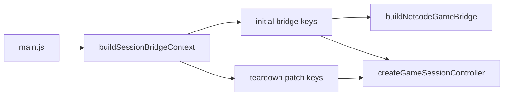

# MAIN-1 — Full wave plan (for Wyatt review)

**Status:** acked 08-04 (Wyatt) · **Lever B complete** (unpushed until this commit) · next: Lever C · v5 inventory locked.  
Prep baseline locked at `f1ec6d1` (qa 109 files / 1,350 tests · battery 6/6 · shoot `shots/2026-08-04-main1-prep/`).

**Card:** [BACKLOG.md](./BACKLOG.md) · MAIN-1 (Medium · Tech debt)  
**Branch:** `cart-clash`  
**Ack unit:** this whole wave (levers A–H). **Commit unit:** one lever per commit.  
**Execution:** **one subagent per lever** (§4) — orchestrator holds the plan/STATUS spine so no single context window eats the whole wave.  
**Mid-wave abort:** if a lever fails its asserts, stop; remaining levers need a fresh continue.  
**Enables:** BUNDLE-1 (menu/game code-split) — out of scope for this wave.

**Phase note:** BRIEFING is still **Playtesting & stabilization**; Run 8 left open FAILs. MAIN-1 is **post-gate tech debt**. Acking this wave means consciously parking FAIL triage for ~3–4 sessions — call that out in the ack, not as a silent side effect.

---

## 1. Goal (done condition)

| Today | After MAIN-1 |
|-------|----------------|
| `main.js` is one ~5.8k-line file; `async function main()` holds **88 inner functions** that escape only via `sessionBridgeCtx`, `initLevelManager` deps, and `runGameLoop` callbacks | `main.js` is a **thin composition root** (~≤1,500 lines soft target; composition clarity beats the number): imports, context creation, module wiring, rAF entry |
| Grep says inner helpers are “dead” | Each domain lives in an owned module under `boot-and-orchestration`; edges stay on the existing **callbacks / deps / bridge** seams |
| BUNDLE-1 blocked | Menu/play entry (`initMenu`, `commitMenuHiddenForGame`, bootstrap hooks) is **physically separable** from the in-round loop — no behavior change required yet |

**Not goals:** rewrite `netcode.js` · strict TypeScript migration · perf retune · new gameplay · shrink bundle size (that is BUNDLE-1) · generic shadow-hazard hoist (filed out of wave — see §10).

**Player-visible bar:** zero regressions on the prep baseline — same menus, rounds, MP join/migrate, podium, rematch, three arenas.

---

## 2. Why it exists

`main.js` is the orchestration spine. Most cross-module edges are **not imports** — they run through:

1. **`buildNetcodeGameBridge`** → `sessionBridgeCtx.current` ([`gameSession.js`](../../src/gameSession.js))
2. **`LevelManagerDeps`** → `initLevelManager({ … })` ([`levelManager.js`](../../src/levelManager.js))
3. **`runGameLoop(loopState, callbacks)`** + **`gameContext` phase deps** ([`gameLoop.js`](../../src/gameLoop.js), [`gameContext.js`](../../src/gameContext.js))
4. **`initBootstrap`** play-entry deps ([`bootstrap.js`](../../src/bootstrap.js))

`sessionBridgeCtx` is written in **exactly two** places today — both must merge into one factory. Teardown reads keys from **both** sites (`destroySessionCarts` lives in the initial literal; timeout clears live in the `Object.assign` patch):



Inner functions inside `main()` are stuffed into those bundles. Moving a function without re-wiring the bundle **silently drops behavior** — the #1 past-agent mistake in [`control-flow.md`](../reference/control-flow.md).

MAIN-1 extracts implementations **along those existing seams**, not by inventing a new framework.

---

## 3. Locked decisions

| Decision | Value |
|----------|--------|
| Behavior | **Mechanical moves only** per lever — no drive-by behavior changes mixed into extraction commits |
| Netcode hooks | Still **three sites**: `netcode.js` stub → adapter → `buildNetcodeGameBridge` key |
| Wire protocol | **No** `MSG.*` shape changes mid-wave |
| New modules | Files under **`src/orchestration/`**; claimed by arch system **`boot-and-orchestration`** (see §5). `archMap.mjs` entry in the **same commit** as each new file — never pre-seed missing paths (`ARCH_MISSING_FILE`). **Ack carves this wave out of the tools/ freeze** for those same-commit claims only (AGENTS.md freeze otherwise applies) |
| Session bridge home | **`buildSessionBridgeContext` in [`gameSession.js`](../../src/gameSession.js)** — already owns the bridge. New `src/orchestration/sessionBridge.js` only if Lever A proves a circular import. |
| Shadow hazard seam | **Out of this wave.** Hoisting `setContactShadowHazards` “before the builder returns” is circular (`levelHazards` is output of `loadLevel`). Booths already pass explicit hazards (`6560552`). File a separate BACKLOG card if a generic pre-build hazard API is wanted. |
| Line budget | `main.js` ≤ **1,500 lines** by lever H (**soft** target; clarity > number) |
| Tests | Every lever: `npm run qa` green by number. **B and C always run their named battery steps.** **Full 6/6 required on F and H.** D/E may skip battery when B+C already green and qa is clean (prefer partial over skip; keep `spawnlock` on E if touching mid-round join). |
| Visual | Lever H: `npm run shoot` all three arenas + `npm run compare` vs `shots/2026-08-04-main1-prep/` |
| Playtest handoff | Before handing production to Wyatt after H deploy: `npm run playtest:console` with numbered steps + `DEPLOYED` SHA/Worker (AGENTS.md) — not just §8 table content |
| Agents | **One fresh subagent per lever** — see §4. Do not run the whole wave in one chat. |

---

## 4. Execution mode (subagents)

MAIN-1 will blow a single context window if one agent owns A→H. Ack locks this execution shape:

| Role | Owns |
|------|------|
| **Orchestrator** (this chat / thin parent) | Plan + STATUS continuity; gate verification; git commit per lever; spawn next agent; mid-wave abort |
| **Lever subagent** | Exactly one lever: read plan § for that lever + [`control-flow.md`](../reference/control-flow.md) Invisible edges; implement; run asserts; report; **stop** |

**Rules:**

1. **Serialize B onward.** Do not parallelize B / C / D / E / F / G / H — they share `sessionBridgeCtx` and round/cart state.
2. **Lever A only** may use a read-only helper agent for the grep inventory (optional); the checklist still lands in one docs commit before B.
3. Subagent **must not** start the next lever or expand scope.
4. After each lever: orchestrator confirms asserts (qa/battery numbers), one commit, then spawn the next.

**Paste brief (orchestrator → subagent):**

```text
MAIN-1 Lever <X> only. Read docs/planning/main-1.md for that lever + docs/reference/control-flow.md § Invisible edges.
Mechanical moves only. Teardown/bridge keys are deps — do not own round-lifecycle state in gameSession (B→D rebind).
Files under src/orchestration/; claim on boot-and-orchestration in archMap in the SAME commit as the new file (tools freeze carve-out for this wave).
Do not touch other tools/ or .claude/hooks/. No MSG.* changes.
Run the lever's asserts; report gate numbers; stop. Do not start the next lever.
```

**Return packet (subagent → orchestrator):** files touched · asserts run · numbers · fail/abort reason if any · whether `sessionBridgeCtx` / deps keys still match pre-lever snapshot.

---

## 5. Architecture (target)

**Path vs system name:** archMap system id is `boot-and-orchestration`. New files live under **`src/orchestration/`** (not `src/boot-and-orchestration/`). Claim each new path on that system in the same commit.

```
┌─────────────────────────────────────────────────────────────────┐
│ main.js (thin)                                                  │
│  createGameContext · createSessionBridgeRefs · createHelloGate  │
│  wire: gameSession · levelManager · bootstrap · netcode · loop  │
│  DOMContentLoaded → main()                                      │
└────────────┬────────────────────────────────────────────────────┘
             │ explicit factories / init functions
     ┌───────┴───────┬──────────────┬──────────────┬─────────────┐
     ▼               ▼              ▼              ▼             ▼
 gameSession.js  levelOrchestration  roundLifecycle  cartOrchestration  menuPlayEntry
 (bridge factory) (LevelManagerDeps  (countdown/     (carts/names/      (initMenu/
                   impls)             podium/SD)      boost/hop/ram)     commitMenuHidden)
             │
             └─► loopDeps.js — builds visual / gameFlow / physics bundles for gameContext
```

**Existing assets to extend (do not duplicate):**

- [`gameSession.js`](../../src/gameSession.js) — `buildNetcodeGameBridge`, `createGameSessionController`, **`buildSessionBridgeContext` (Lever B)**, `wireNetcodeRuntimeRefs`
- [`gameContext.js`](../../src/gameContext.js) — loop phase registry
- Top-level helpers already **outside** `main()` (~20 fns): `updateCartMaterialsFromSlots`, `teleportCartToSpawn`, `displayColorHexForSlot`, … — move with their domain, not left orphaned

---

## 6. Inner-function inventory (inside `main()`)

**Locked 08-04 (Lever A)** against HEAD `f1ec6d1`. Grep:
`Select-String -Path src/main.js -Pattern '^\s+(async )?function '` → **88** matches.
Every symbol has **exactly one** target module — full checklist in [Appendix A](#appendix-a--symbol-checklist-88).
**Do not start Lever B until** this section + appendix are committed.

| Domain | Count | Locked target | Lever |
|--------|------:|---------------|-------|
| Menu / play entry (+ audio unlock/music) | 10 | `src/orchestration/menuPlayEntry.js` | G |
| Level / arena (+ quality rebuild) | 21 | `src/orchestration/levelOrchestration.js` | C |
| Round lifecycle | 21 | `src/orchestration/roundLifecycle.js` | D |
| Cart / combat / NPC / juice / FX | 31 | `src/orchestration/cartOrchestration.js` | E |
| Host-tab lifecycle | 4 | `src/orchestration/loopDeps.js` | F |
| Misc wiring | 1 | [`gameSession.js`](../../src/gameSession.js) (`wireNetcodeRuntimeRefs`) | B |
| **Total** | **88** | | |

**Locks that closed draft “or” rows:**

- **Juice / FX** → `cartOrchestration.js` (not loopDeps)
- **Audio / music** (`prepareLevelMusic`, `startLevelMusic`, `unlockAudio`) → `menuPlayEntry.js` (not level)
- **`updateTouchControlsVisibility`** → `menuPlayEntry.js` (also referenced from `visualDeps` in F; body owns with menu)
- **`currentCartSnapshot`** → `cartOrchestration.js` (definition has no live call sites today — still move with cart; Lever H may delete if still dead)
- **Host-tab** is **4** functions (`shouldPumpHiddenHost`, `clearHostAwayTimer`, `armHostAwayTimerIfNeeded`, `refreshHiddenHostLifecycle`) — draft “5” was overcount

---

## 7. Levers

### Lever A — Map + contracts (docs-only commit)

**Goal:** freeze the extraction map before code moves — **no archMap edits**.

**Files:** `docs/planning/main-1.md` (this doc, full symbol checklist) · `docs/reference/control-flow.md` (symbol anchors, drop stale line refs per ARCH-DRIFT-1)

**Asserts:**

- [x] Grep count reconciled with §6 / appendix — **88/88**, every inner function assigned to exactly one module
- [x] Ambiguous Juice / Audio rows locked (no “or”)
- [x] `npm run qa` green — **109 files / 1,350 tests** (plus knip · briefing · arch · health)
- [x] `control-flow.md` references symbols, not line numbers, for `buildNetcodeGameBridge`, `initLevelManager`, `runGameLoop`, and both `sessionBridgeCtx` write sites (`sessionBridgeCtx.current = {` · `Object.assign(sessionBridgeCtx.current, {`)

**Risk:** pre-seeding `archMap.mjs` with non-existent files trips `ARCH_MISSING_FILE`; keep archMap edits in the same commit that creates each new module.

---

### Lever B — Session bridge factory

**Goal:** collapse **both** `sessionBridgeCtx` write sites into `buildSessionBridgeContext(deps)` in [`gameSession.js`](../../src/gameSession.js) (preferred home). New `src/orchestration/sessionBridge.js` only if Lever A proves a circular import.

Must merge both source sites (grep confirms exactly two):

- [`sessionBridgeCtx.current = {`](../../src/main.js) — netcode/gameplay bridge surface (includes `destroySessionCarts`, etc.)
- [`Object.assign(sessionBridgeCtx.current, {`](../../src/main.js) — teardown patch surface used by [`createGameSessionController`](../../src/gameSession.js)

**Includes:** `wireNetcodeRuntimeRefs` (misc wiring — owns with this lever)

Preserve these patched teardown keys explicitly:

`clearRoundCountdownTimeout`, `clearAutoContinuePodiumTimeout`, `clearPodiumRoundTimeout`, `resetSlowMo`, `resetSimTiming`, `hideResultsOverlay`, `resetLeaderHum`, `resetResultsOverlayKey`, `resetPodiumSessionState`

**Ownership caution:** those nine keys are closures over round-lifecycle state (`roundPodiumTimeoutId`, `autoContinuePodiumKey`, `lastResultsOverlayKey`, `clearPodiumPresentation`, …) — the same state Lever D extracts. The factory **receives them as deps**; it must **not** own that state. Lever D rebinds them later.

Call the factory **once** after all referenced handlers exist (or pass already-bound deps) — no partial extract.

**Files:** [`src/gameSession.js`](../../src/gameSession.js) · `src/main.js`

**Asserts:**

- [x] `buildNetcodeGameBridge` still resolves every key (existing tests cover netcode registration)
- [x] `createGameSessionController` teardown still reaches `clearRoundCountdownTimeout`, `destroySessionCarts`, and the patched teardown keys listed above
- [x] `Select-String sessionBridgeCtx src/main.js` shows **no assignment sites** left (`=` / `Object.assign`) — only `= buildSessionBridgeContext({`
- [x] `npm run qa` green — **109** files / **1,350** tests
- [x] `npm run battery -- --only spawnlock,teardownRejoin` — **2/2 PASS** (6/6 + 8/8)

**Risk:** extracting only the first site silently drops teardown keys **or** site-1 keys teardown also reads (`destroySessionCarts`); `teardownRejoin` is the regression gate.

---

### Lever C — Level orchestration (mechanical only)

**Goal:** move all `LevelManagerDeps` implementations and level-load helpers out of `main()` — **same call order as today**. Leave `setContactShadowHazards` where it is (inside [`applyLoadedLevelSideEffects`](../../src/main.js)).

**Files:** new `src/orchestration/levelOrchestration.js` · `src/main.js` · `src/levelManager.js` (imports only if needed) · `tools/lib/archMap.mjs` (claim new file same commit)

**Includes:**

- `commitLevelLoad`, `bootstrapWorldCore`, `rotateLoadedArenaInPlace`, `warmupActiveSceneShaders`, `maskMenuPreviewSwap`
- `finalizeArenaForPlay`, `finalizeArenaShellForMenu`, rave dressing helpers
- `rebuildForQualityChange` (quality / rebuild bucket)

**Asserts:**

- [ ] `npm run qa` green
- [ ] `npm run battery -- --only gameharness,hostReload` (full `gameharness` rig — all scenarios; `--only` has no per-scenario filter — **or** `node tools/gameharness.mjs --scenario arenas` plus `npm run battery -- --only hostReload`)
- [ ] Menu arena picker swap does not freeze (attract path still calls shared animation hooks)
- [ ] Quality-tier toggle still rebuilds arena (spot-check Low↔High or settings quality change)

**Risk:** arena rotation / quickplay rematch ordering (NET-1 class) — **`hostReload` is in this lever’s battery**, not deferred to F. A fail here is a **move/drop** bug.

---

### Lever D — Round lifecycle

**Goal:** countdown → running → podium → rematch logic lives in `roundLifecycle.js`; `sessionBridgeCtx` and loop deps receive **bound methods** (rebind the teardown deps Lever B received).

**Files:** new `src/orchestration/roundLifecycle.js` · `src/main.js` · `tools/lib/archMap.mjs`

**Includes:** `startCountdown`, `endRound`, `startRunningAt`, SD helpers, podium presentation, `onHostPlayAgainClick`, auto-continue podium

**Asserts:**

- [ ] `npm run qa` green
- [ ] Battery: `npm run battery -- --only gameharness,mpIntegration` — **or** skip battery if B+C already green and qa is clean (prefer partial over skip)
- [ ] No duplicate countdown starts (solo pause → rematch path unchanged)

**Risk:** `podium ⇄ running` wedge class — `ROUND-WEDGE-1` is closed; watch `invariants.js` assert on deliberate rollback

---

### Lever E — Cart orchestration

**Goal:** cart spawn/teardown, name labels, boost/hop/ram, NPC opportunistic helpers extracted (plus Juice symbols locked in A).

**Files:** new `src/orchestration/cartOrchestration.js` · `src/main.js` · `tools/lib/archMap.mjs`

**Asserts:**

- [ ] `npm run qa` green
- [ ] Battery: `npm run battery -- --only spawnlock,gameharness` — **or** skip full battery if B+C already green (keep at least `spawnlock` if touching mid-round join)
- [ ] Mid-round join still drives (`spawnlock` displacement checks) when battery runs

**Risk:** charge SFX orphan on teardown — `stopAllChargeSfx` must stay on session teardown path (also covered by §8 audio row)

---

### Lever F — Loop deps assembly

**Goal:** `visualDeps` / `gameFlowDeps` / `physicsDeps` object literals (~115 lines for the three literals; ~270–370 with the sim-callback region) move to `loopDeps.js`; `gameContext.attachDeps` unchanged in behavior.

**Files:** new `src/orchestration/loopDeps.js` · `src/main.js` · possibly [`gameContext.js`](../../src/gameContext.js) · `tools/lib/archMap.mjs`

**Includes:** host-tab pump hooks (`refreshHiddenHostLifecycle`), simulation callback bundle, frame juice reads

**Asserts:**

- [ ] `npm run qa` green
- [ ] `npm run battery` **full 6/6** (required)
- [ ] Hidden-host pump still works (HOST-TAB-1 regression — manual spot-check if battery lacks a step)

**Risk:** `deps.*` typo = silent skip inside `runGameLoop` — diff the keys against pre-lever snapshot

---

### Lever G — Menu / play entry seam (BUNDLE-1 unlock)

**Goal:** `initMenu`, `commitMenuHiddenForGame`, bootstrap hooks, music entry, and menu↔game visibility live in `menuPlayEntry.js` with a single `initMenuPlayEntry(deps)` called from `main()`.

**Files:** new `src/orchestration/menuPlayEntry.js` · `src/main.js` · `tools/lib/archMap.mjs`

**Asserts:**

- [ ] `npm run qa` green
- [ ] `npm run battery -- --only gameharness` (covers unlockFunnel + roundflow among other scenarios)
- [ ] Quickplay / friends / invite / solo / testdrive entry paths still reach `carts-ready`
- [ ] Menu attract animates (SHOOT-ANIM-1/2 regression)
- [ ] Level music starts on play entry (spot-check; also §8 row 8)

**Risk:** highest coupling lever — do not start until B–F are green

---

### Lever H — Thin `main.js` + done gate

**Goal:** `main()` is wiring only; move any remaining top-level helpers into their domain modules; delete dead closure state.

**Files:** `src/main.js` · touched orchestration modules

**Asserts:**

- [ ] `main.js` ≤ 1,500 lines soft target (report actual count in commit message; clarity wins if slightly over)
- [ ] `npm run qa` green (includes knip — no separate knip assert)
- [ ] `npm run battery` **full 6/6** (required)
- [ ] `npm run shoot` classic + storerooms + sundial → `shots/main-1-done/`
- [ ] `npm run compare` vs `shots/2026-08-04-main1-prep/` — no unintended visual drift (document intentional diffs)
- [ ] Quality-tier toggle spot-check if not already signed off in C
- [ ] Deploy → fetch prod chunk → `npm run playtest:console` with **numbered steps** + `DEPLOYED` SHA/Worker for each §8 check — then hand console to Wyatt

**Card close:** update BACKLOG MAIN-1 row · STATUS.md wave boundary · note BUNDLE-1 unblocked. SHADOW-HAZARD-SEAM-1 already filed — leave alone unless this wave learns something new.

---

## 8. Verification matrix (Wyatt playtest — lever H)

**Before handoff:** run `npm run playtest:console`, confirm each owed card has a one-line goal, non-empty numbered steps, and deploy context (`DEPLOYED` + SHA/Worker). Do not hand Wyatt the console path until that passes (AGENTS.md).

Run on **production** after deploy (behavior-changing wave — do not skip):

| # | Check | Pass looks like |
|---|--------|-----------------|
| 1 | Solo quickplay | Menu → play → countdown → round → podium → PLAY AGAIN → fresh round |
| 2 | Friends lobby | Host ready → non-host joins → both drive → round completes |
| 3 | Mid-round join | Joiner drives within ~3s of spawn (NET-2 bar) |
| 4 | Host tab hide | Brief hide: world moves; 10s hide: migrate toast; return: reclaim if ahead by 20 |
| 5 | Arena rotation | Quickplay rematch lands on a different arena; visuals match selection |
| 6 | Three arenas | Classic · Storerooms · Sundial each load from menu picker without black frame |
| 7 | ESC solo pause | Pause freezes clock; resume continues; rematch from pause works |
| 8 | Audio | Level music starts on round/play entry; charge SFX stops on KO and on menu/teardown |

Automated prep baseline (local, already green at `f1ec6d1`):

| Gate | Result |
|------|--------|
| `npm run qa` | 109 files / 1,350 tests |
| `npm run battery` | 6/6 rigs · 93/93 checks · [report](../../.diag-captures/battery-2026-08-04T06-46-47-754Z.json) |
| `npm run shoot` | [shots/2026-08-04-main1-prep/](../../shots/2026-08-04-main1-prep/) |

Re-run battery + compare after lever H before deploy.

---

## 9. Risks & abort triggers

| Risk | Mitigation | Abort if |
|------|------------|----------|
| Silent callback drop | Diff bridge/deps keys each lever; read `control-flow.md` recipe | Any battery netcode step fails twice after fix attempt |
| Level swap race | Keep `arenaRotationInFlight` / `isSessionPlayReady` on bridge; C runs `hostReload` | `hostReload` or quickplay rematch fails |
| Podium wedge | Do not touch `podiumEndLatch` / netcode rollback without cause | Podium flicker reproduces |
| Scope creep | FX-TIME-1 · SHADOW-ORDER-1 · HOST-TAB-1 are **closed** — do not re-open; no shadow-hoist redesign mid-wave | — |
| Timebox | ~45 min or 3 failed attempts per lever | Write 5-line findings to STATUS.md; escalate |

---

## 10. Out of scope (explicit)

- **BUNDLE-1** — dynamic `import()` split; separate card after MAIN-1 closes
- **STORE-1** — gameState/gameStore collapse; optional follow-up
- **netcode.js / party/ splits** — separate cards if ever needed
- **Level file splits** (`backroomsSupermarket.js`, etc.)
- **Generic shadow-hazard hoist / pre-build hazard API** — cut from wave (circular with builder output; booths already fixed via explicit hazards). Tracked as **SHADOW-HAZARD-SEAM-1** in [BACKLOG.md](./BACKLOG.md).
- **Run 8 FAIL triage** — parked for the duration of this wave if acked; not closed by MAIN-1

---

## 11. Suggested timeline

| Lever | Est. | Battery | Cumulative |
|-------|-----:|---------|-----------:|
| A docs | 30 min | none | 0.5 h |
| B session bridge | 45 min | `spawnlock,teardownRejoin` | 1.25 h |
| C level (mech) | 60 min | `gameharness,hostReload` | 2.75 h |
| D round | 60 min | optional if B+C green | 4 h |
| E cart | 45 min | optional / keep `spawnlock` | 5 h |
| F loop deps | 60 min | **full 6/6 (~13 min)** | 6.5 h |
| G menu entry | 75 min | `gameharness` | 8 h |
| H thin main + QA | 45 min | **full 6/6 (~13 min)** + shoot + playtest console | 9.5 h |

Required full battery runs are **F + H ≈ ~26 min** wait, not 1.3 h. Partials on B/C/G add more. Plan for **3–4 sessions**. Never skip full battery on **F** or **H**.

---

## 12. Ack checklist (Wyatt)

- [x] Consciously parking Run 8 FAIL triage for ~3–4 sessions (phase still Playtesting)
- [x] **One subagent per lever** (§4) — orchestrator holds spine; no whole-wave single chat
- [x] Lever order A → B → C → D → E → F → G → H accepted
- [x] **C2 cut** — shadow-hazard generic hoist out of wave; SHADOW-HAZARD-SEAM-1 already filed
- [x] `archMap.mjs` same-commit claims are **in scope this wave** (tools-freeze carve-out for new orchestration files only)
- [x] `main.js` ≤ 1,500 soft line target OK
- [x] Lever B factory home = [`gameSession.js`](../../src/gameSession.js) unless A proves circular import
- [x] Lever B covers both `sessionBridgeCtx` write sites (initial + `Object.assign`); teardown keys as deps only; `wireNetcodeRuntimeRefs` in B
- [x] Do not start B until A’s full symbol checklist is committed
- [x] Production playtest §8 (incl. audio row) + `playtest:console` owed on lever H deploy
- [x] Proceed — Wyatt ack 08-04 (“review; if nothing jumps out, begin”)

**Lever B+ code starts only after Lever A’s docs commit lands.**

---

## Appendix A — Symbol checklist (88)

Grep at Lever A: **88** inner `function` / `async function` declarations inside `main()`.
Target module is locked; lever column is who moves the body.

### `menuPlayEntry.js` (10) — Lever G

| Symbol | Notes |
|--------|--------|
| `prepareLevelMusic` | audio locked here |
| `startLevelMusic` | audio locked here |
| `unlockAudio` | audio locked here |
| `updateTouchControlsVisibility` | also passed into `visualDeps` (F) |
| `onMenuBootstrapError` | |
| `bootstrapNetcodeFromMenu` | |
| `makeSoloArenaReadyHook` | |
| `makeMultiplayerArenaReadyHook` | |
| `initMenu` | |
| `commitMenuHiddenForGame` | |

### `levelOrchestration.js` (21) — Lever C

| Symbol | Notes |
|--------|--------|
| `rebuildForQualityChange` | quality/rebuild bucket |
| `ensureRapierPhysics` | |
| `consumeRaveJuiceJustBuilt` | |
| `levelUsesRaveExtras` | |
| `raveDressingWanted` | |
| `tickRaveDressing` | |
| `applyLoadedLevelSideEffects` | keep `setContactShadowHazards` call order |
| `ensureRaveAttractShell` | |
| `initDeferredRaveVisuals` | |
| `scheduleReflectorUpgrade` | |
| `finalizeArenaShellForMenu` | |
| `finalizeArenaForPlay` | |
| `warmupActiveSceneShaders` | |
| `fadeGameCanvasTo` | used by mask swap |
| `maskMenuPreviewSwap` | |
| `commitLevelLoad` | |
| `bootstrapWorldCore` | |
| `whenArenaRotationSettled` | |
| `drainPendingArenaRotation` | |
| `pickNextQuickplayArenaId` | |
| `rotateLoadedArenaInPlace` | |

### `roundLifecycle.js` (21) — Lever D

| Symbol | Notes |
|--------|--------|
| `resolveCinematicCountdownOverrides` | |
| `beginRoundFlyover` | |
| `getWinnerWorldPos` | podium |
| `beginPodiumPresentation` | |
| `clearPodiumPresentation` | |
| `updateResultsOverlay` | |
| `startRunningAt` | |
| `clearRoundCountdownTimeout` | teardown dep for B |
| `startCountdown` | |
| `resumeCountdownAsNewHost` | |
| `ensureSuddenDeathStateAsNewHost` | |
| `cancelLastCartStandingFinish` | |
| `abortLastCartStandingFlourish` | |
| `scheduleLastCartStandingFinish` | |
| `endRound` | |
| `clearAutoContinuePodiumTimeout` | teardown dep for B |
| `currentPodiumAutoContinueKey` | |
| `maybeScheduleAutoContinuePodium` | |
| `updatePlayAgainCountdownLabel` | |
| `handleSoloPauseOverlay` | |
| `onHostPlayAgainClick` | |

### `cartOrchestration.js` (31) — Lever E

| Symbol | Notes |
|--------|--------|
| `triggerImpactPulse` | juice |
| `armFovPunch` | juice |
| `triggerLocalRamShake` | juice |
| `triggerLocalHitTaken` | juice |
| `pulseLocalHitDirectionVignette` | juice |
| `_playerAccentFromHud` | juice |
| `squashCartsOnImpact` | juice |
| `onLocalKillConfirm` | juice |
| `onArenaKoFlash` | juice |
| `triggerSpillNetcode` | juice |
| `presentSpillBonusAward` | juice |
| `stopChargeSfxForCart` | teardown / KO path |
| `stopAllChargeSfx` | teardown path |
| `scheduleRespawn` | |
| `scheduleStuckRespawn` | |
| `makeNameLabel` | |
| `updateNameLabels` | |
| `positionNameLabels` | |
| `bootstrapSessionCarts` | |
| `destroySessionCarts` | bridge + teardown |
| `getAiAxis` | |
| `triggerRamBoost` | |
| `onBoostRelease` | |
| `onBoostCancel` | |
| `isCartGrounded` | |
| `attemptLocalHop` | |
| `triggerHop` | |
| `onHopLand` | |
| `maybeTriggerNpcOpportunisticRamBoost` | |
| `maybeTriggerNpcOpportunisticHop` | |
| `currentCartSnapshot` | no live callers at inventory time — move anyway; H may delete |

### `loopDeps.js` (4) — Lever F

| Symbol | Notes |
|--------|--------|
| `shouldPumpHiddenHost` | HOST-TAB-1 |
| `clearHostAwayTimer` | HOST-TAB-1 |
| `armHostAwayTimerIfNeeded` | HOST-TAB-1 |
| `refreshHiddenHostLifecycle` | HOST-TAB-1 |

### `gameSession.js` (1) — Lever B

| Symbol | Notes |
|--------|--------|
| `wireNetcodeRuntimeRefs` | misc wiring; move with bridge factory |

**Checksum:** 10 + 21 + 21 + 31 + 4 + 1 = **88**.